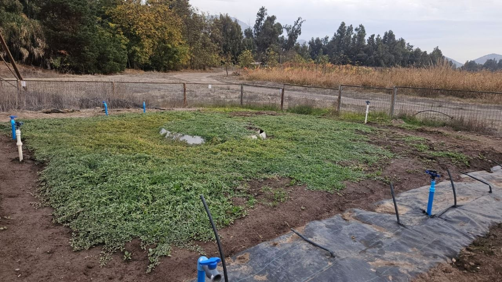
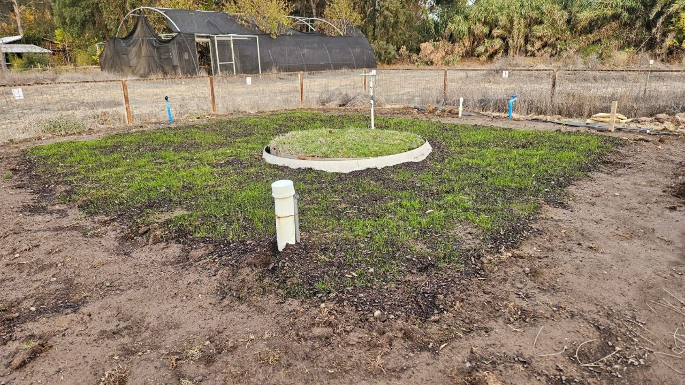

# Plataforma de lisimetría

Los ensayos de lisimetría se desarrollan en la Fundación AgroUC (Pirque, Región Metropolitana, Chile).

Los lisímetros de pesada permiten determinar el consumo real de agua mediante el seguimiento continuo de cambios de masa, transformando posteriormente dichos cambios en lámina de agua evapotranspirada.

## Cubresuelo nativo (Tiqui-tiqui)

{fig-alt="Lisímetro con cubresuelo nativo" width="100%"}

Este lisímetro contiene un cubresuelo nativo utilizado como alternativa ornamental de bajo requerimiento hídrico.

Las mediciones permiten estimar:

- Evapotranspiración real.
- Coeficiente de cultivo.
- Eficiencia hídrica.
- Respuesta estacional.

---

## Pasto alfombra

{fig-alt="Lisímetro con pasto alfombra" width="100%"}

Este lisímetro contiene pasto alfombra, utilizado como referencia por ser una de las coberturas más empleadas en áreas verdes urbanas.

La comparación con especies nativas permite cuantificar potenciales ahorros de agua en el diseño de paisajes urbanos mediterráneos.

---

## Variables monitoreadas

::: {.card-grid}
::: {.puma-card}
### Variables ambientales

- Temperatura del aire
- Humedad relativa
- Radiación solar
- Velocidad del viento
- Precipitación
:::

::: {.puma-card}
### Variables lisimétricas

- Masa del lisímetro
- Cambio de almacenamiento
- Evapotranspiración diaria
- Evapotranspiración acumulada
- Coeficiente de cultivo
:::
:::