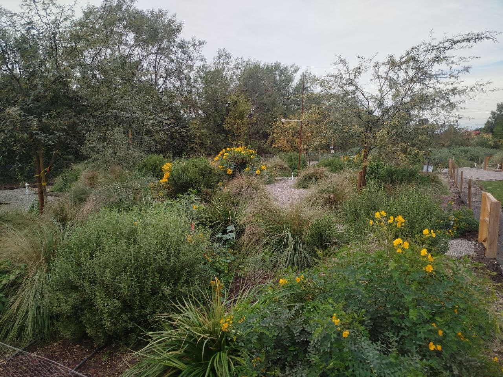
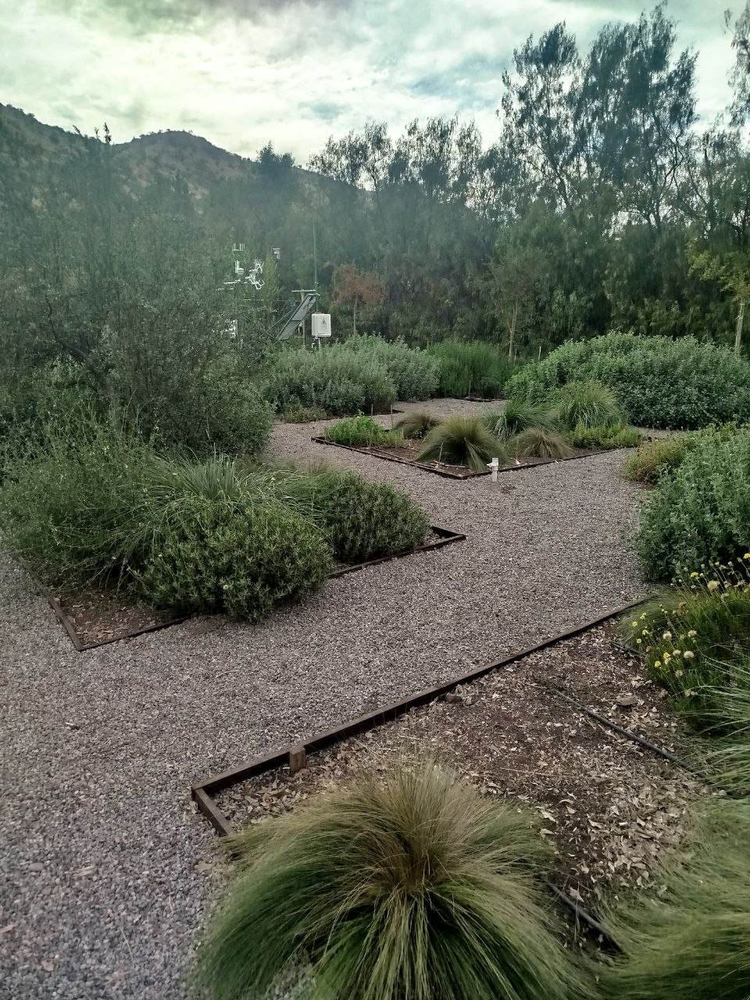
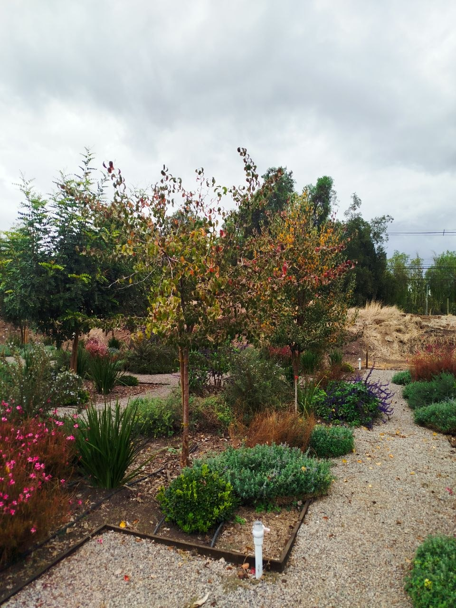

## Diseño del ensayo

El ensayo principal se desarrolla en tres parcelas que representan estrategias contrastantes de paisajismo: una parcela con especies exóticas tradicionales y dos parcelas con especies nativas agrupadas en categorías agroecológicas CAE1 y CAE2.

::: {.card-grid}
::: {.puma-card}
### Exótica
<div class="metric">250 m²</div>
Especies ornamentales de uso frecuente en áreas verdes chilenas.
:::

::: {.puma-card}
### CAE1
<div class="metric">250 m²</div>
Especies nativas adaptadas a baja disponibilidad hídrica.
:::

::: {.puma-card}
### CAE2
<div class="metric">1000 m²</div>
Especies nativas con mayor superficie experimental e instalación de torre Eddy Covariance.
:::
:::

## Grupos vegetales

```{r}
#| label: especies-tabla
#| echo: false
library(tibble)
library(DT)
especies <- tribble(
  ~Grupo, ~Tipo, ~Nombre_comun, ~Nombre_cientifico, ~Unidades,
  "Exótica", "Árboles", "Algarrobo europeo", "Ceratonia siliqua", 3,
  "Exótica", "Árboles", "Jacaranda", "Jacaranda mimosifolia", 3,
  "Exótica", "Árboles", "Peral de flor", "Pyrus calleryana", 3,
  "Exótica", "Arbustos", "Romero", "Romero tuscani", 17,
  "Exótica", "Arbustos", "Pittosporo enano", "Pittosporum tobira nana", 23,
  "Exótica", "Arbustos", "Westringia", "Westringia fruticosa", 20,
  "Exótica", "Arbustos", "Nandina", "Nandina domestica", 12,
  "Exótica", "Herbáceas", "Dietes", "Dietes grandifolia", 31,
  "Exótica", "Herbáceas", "Nepeta", "Nepeta mussini", 36,
  "Exótica", "Herbáceas", "Gaura", "Gaura lindheimeri", 30,
  "Exótica", "Herbáceas", "Salvia farinácea", "Salvia farinacea", 18,
  "CAE1", "Árboles", "Algarrobo blanco", "Neltuma alba", 3,
  "CAE1", "Árboles", "Chañar", "Geoffroea decorticans", 3,
  "CAE1", "Árboles", "Tamarugo", "Strombocarpa tamarugo", 3,
  "CAE1", "Arbustos", "Quebracho del norte", "Senna cumingii var. cumingii", 16,
  "CAE1", "Arbustos", "Maravilla del campo", "Flourensia thurifera", 8,
  "CAE1", "Arbustos", "Balbisia / Copa de Oro", "Balbisia peduncularis", 10,
  "CAE1", "Arbustos", "Vautro", "Baccharis macraei", 14,
  "CAE1", "Herbáceas", "Chupalla", "Eryngium paniculatum", 22,
  "CAE1", "Herbáceas", "Stipa", "Amelichloa caudata", 52,
  "CAE1", "Herbáceas", "Escabiosa", "Erigeron luxurians", 19,
  "CAE1", "Herbáceas", "Alstroemeria norte", "Alstroemeria norte", 24,
  "CAE2", "Árboles", "Quillay", "Quillaja saponaria", 9,
  "CAE2", "Árboles", "Huingán", "Schinus polygamus", 14,
  "CAE2", "Árboles", "Molle", "Schinus latifolia", 7,
  "CAE2", "Arbustos", "Malva de cerro", "Sphaeralcea obtusiloba", 67,
  "CAE2", "Arbustos", "Oreganillo", "Teucrium bicolor", 70,
  "CAE2", "Arbustos", "Buchu", "Haplopappus uncinatus", 110,
  "CAE2", "Arbustos", "Baccharis neaei", "Baccharis neaei", 47,
  "CAE2", "Herbáceas", "Stachys macraei", "Stachys macraei", 133,
  "CAE2", "Herbáceas", "Nasella", "Nassella laevissima", 329,
  "CAE2", "Herbáceas", "Alstroemeria", "Alstroemeria ligtu simsii", 72,
  "CAE2", "Herbáceas", "Azulillo", "Pasithea caerulea", 187
)
DT::datatable(especies, filter = "top", options = list(pageLength = 12, scrollX = TRUE))
```

## Resumen por grupo

```{r}
#| label: resumen-especies
#| echo: false
library(dplyr)
library(ggplot2)
library(plotly)
res <- especies |>
  group_by(Grupo, Tipo) |>
  summarise(Unidades = sum(Unidades), Especies = n(), .groups = "drop")

p <- ggplot(res, aes(Grupo, Unidades, fill = Tipo, text = paste("Tipo:", Tipo, "<br>Unidades:", Unidades))) +
  geom_col() +
  labs(x = NULL, y = "Número de individuos", fill = "Tipo") +
  theme_minimal(base_size = 13)
ggplotly(p, tooltip = "text")
```


## Parcela CAE1

{fig-alt="Parcela CAE1" width="100%"}

La parcela CAE1 está compuesta por especies nativas y adaptadas al clima mediterráneo de Chile central. En esta parcela se monitorean variables de balance energético, temperatura superficial, humedad del suelo y evapotranspiración.

---

## Parcela CAE2

{fig-alt="Parcela CAE2" width="100%"}

La parcela CAE2 incorpora una composición vegetal diferente, permitiendo comparar respuestas ecofisiológicas y energéticas frente a las mismas condiciones atmosféricas.

---

## Parcela de especies exóticas

{fig-alt="Parcela de especies exóticas" width="100%"}

La parcela de especies exóticas representa un modelo ornamental ampliamente utilizado en paisajismo urbano. Su comparación con especies nativas permite evaluar oportunidades de reducción del consumo hídrico en áreas verdes.
